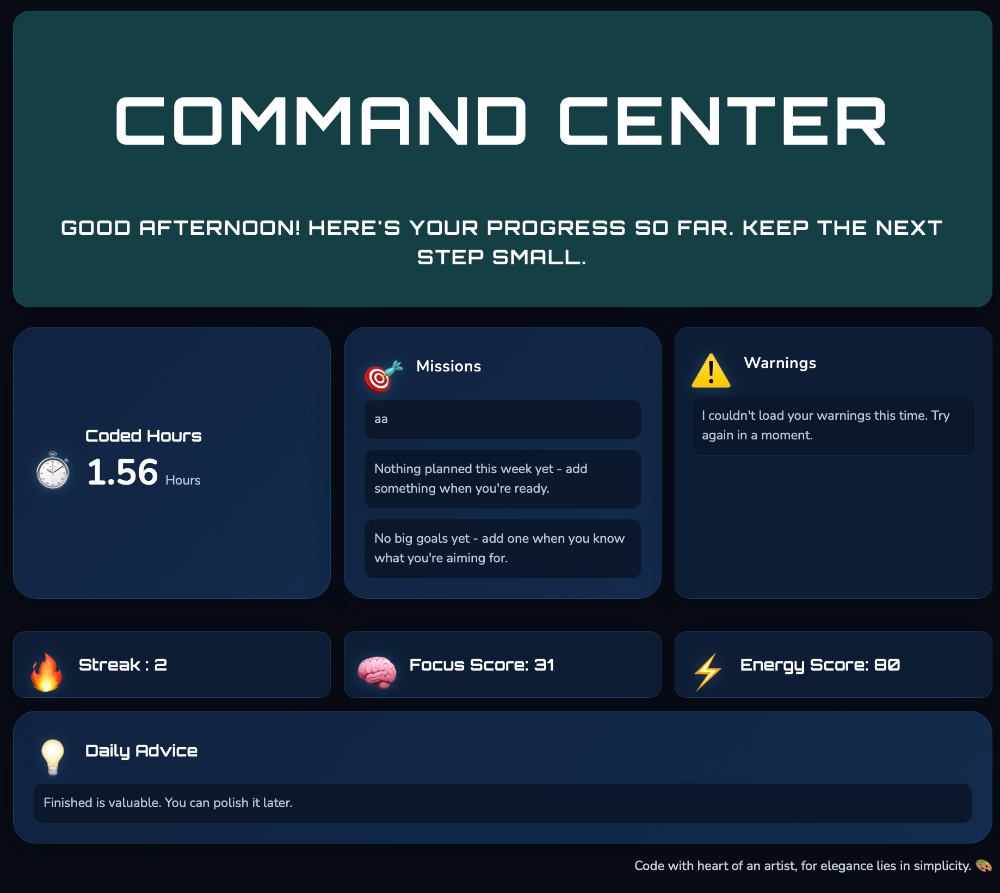
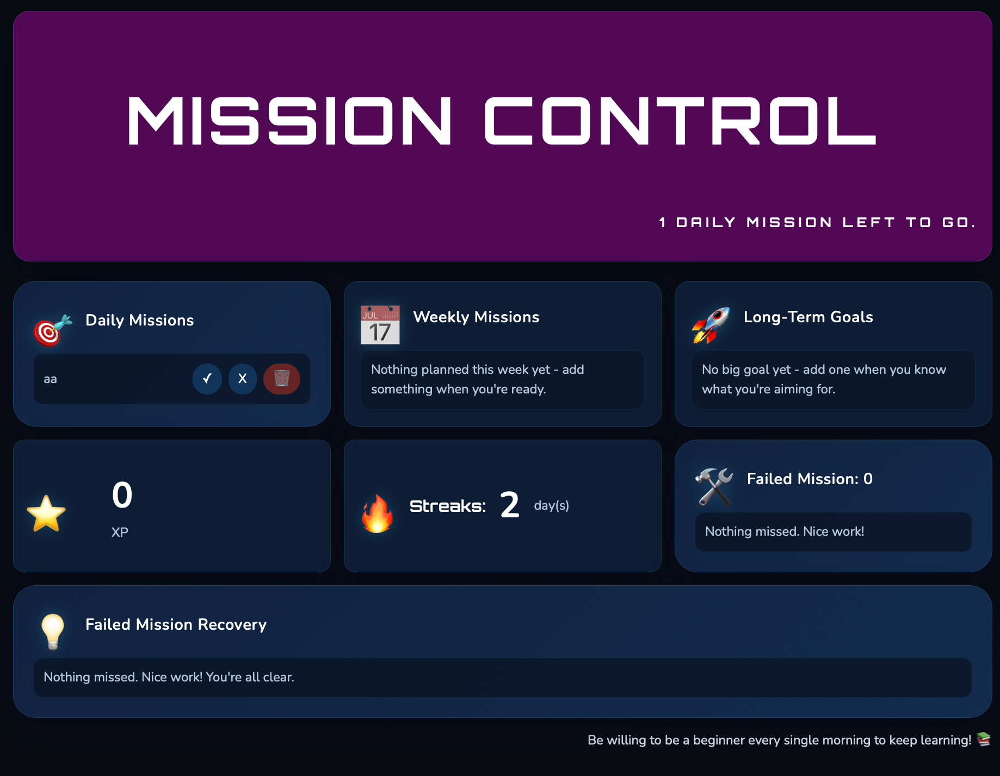
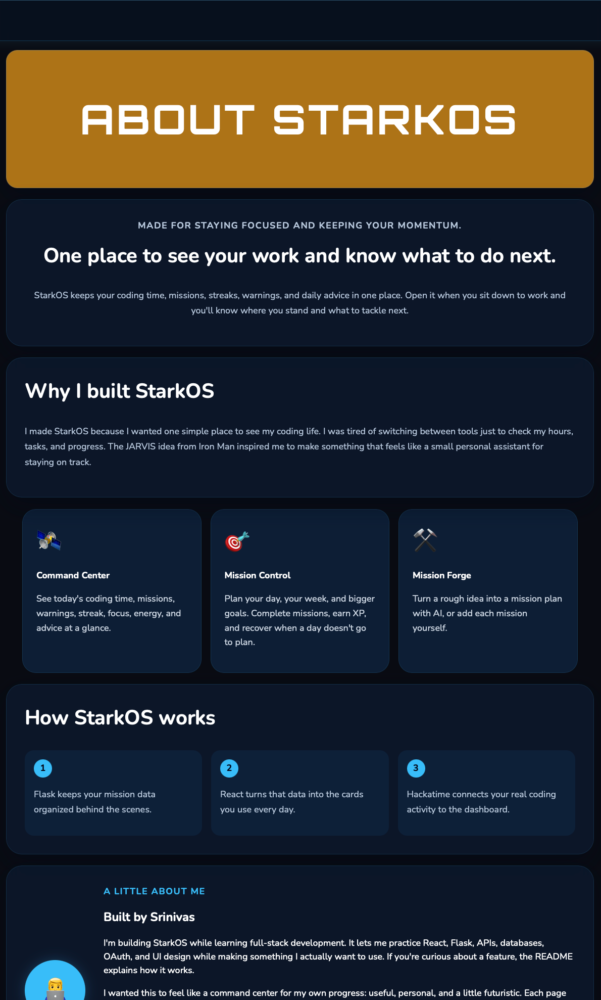

# StarkOS-Web

StarkOS is named after the operating system of Tony Stark (Iron Man). Anyways, this is a web app that I built to help me and other hackers to track their work, plan everything in one place, and make yourself feel like you are in the movies.

This is the version 1 of the app, I will try to make it even better and functional for V2.

## Some pics of the App

## AI Usage

I used inline-suggestions, but mostly used it to style the app a bit so it looks better, also used a file template that is made using running a vite command. This is also my first ever react project, and using flask as backend. So, took help from AI learning and implemmenting. I have really worked hard on this project, I only used AI to write css(mostly the navigation) and help me understand when i needed to. This is the real use. Also, about the UI, i want to keep it minimal, so I choose this design of flashcards, thats why you see I reused them. I didn't use AI create the whole UI, just a little styling. I don't understand why it looks like AI, I got inspired from the Heads over display (HUD) in Iron Man. Hope you understand it.

# Pages

The pages have everything a basic coder needs. You can add missions, delete them and track your time, streaks with hackatime login.

It also grades them on how they do and it works exactly as expected and easier to start.
If you want to try it out, [click here](https://stark-os-web-eight.vercel.app)

Please feel free to visit the demo and give me feedback on what to ship for V2. I will try to implement them as much as possible. I will also try to make it more functional and add more features in V2.

## Note

Finally, sorry for not declaring the AI usage in the beginning, I was just too vague, but I declared it now. THe UI is just styled to be like it, simple and minimal, I didn't use the AI to create the whole UI, just a little styling. I hope you understand it. I will try to make it more functional and add more features in V2. Looking forward!