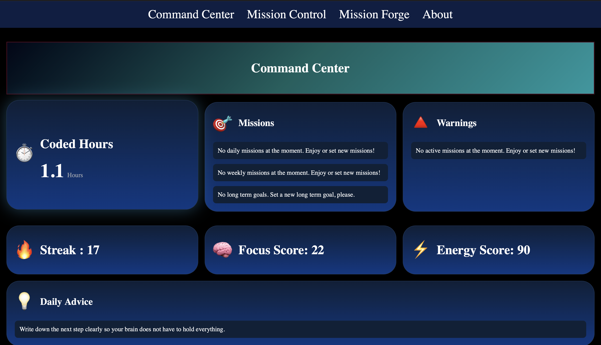
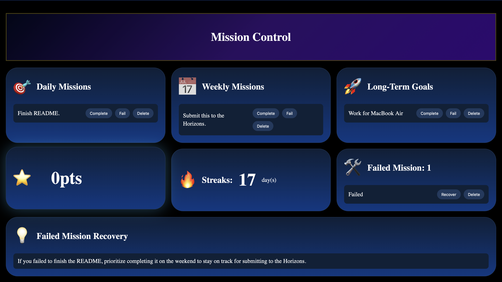
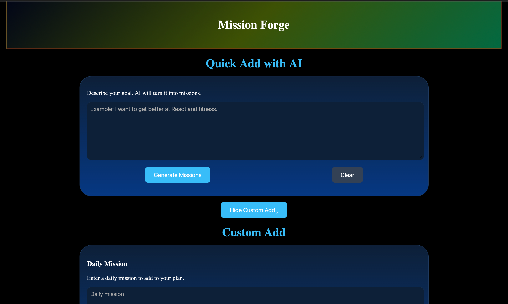
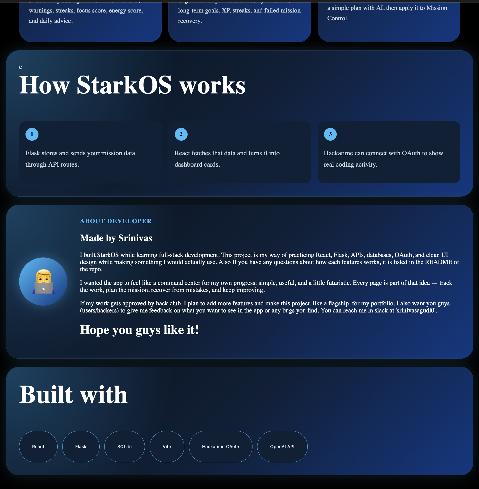

# StarkOS-Web

StarkOS is named after the operating system of Tony Stark (Iron Man). Anyways, this is a web app that I built to help me and other hackers to track thier work, plan eveything in one place, and learn from mistakes.

This is the version 1 of the app, I will try to make it even better and functional for V2.

# How everything works
The app is divided into 4 pages:

- *Command-Center*
- *Mission-Contol*
- *Mission-Forge*
- *About*

Each section is unique and has its own use.

## Command-Center

The command center is the main page of the app. It has

- **Coded Hours** - The hours you have coded today, this is fetched from `Hackatime`.
- **Missions** - It displays `all` the missions you have created regardless of whether they are daily, weekly, or long-term goals.
- **Warnings** - This says users what not to do `sugesstions` based on the missions. If there are no missions, it will be showing a placeholder message.
- **Streak** - This shows how many days you have coded, also fetched from `hackatime`.
- **Focus Score** - This will indicate how focused you are. It determines the score by the formula `min (hours*20, 100)`.
- **Energy Score** - This will indicate how much energy you have left/putting into you work. It is determined with a simple formula of `productivity + consistency + balance`.
- **Daily Advice** - This gives a simple daily `advice`.

## Mission Control

The mission control is where you can manage you tasks not just view them. The missions are also classified as daily, weekly, long and failed.

- **Daily Missions** - This is where you can view your daily missions. Also if not completed by the midnight it will be transferred to the failed missions section.
- **Weekly Mission** - Simply missions for your week, even this will transfer to failed missins after a week of no change.
- **Long Term Missions** - This shows all your long term goals and these will transfer to failed missions after 90 days.
- **XP Point** - XP points is calculated as follows:
    - Daily mission completed = +20 xp
    - Weekly Mission completed = +50 xp
    - Long Term Mission completed = +120 xp
    - Failed Mission = -25 xp
- **Streak** - The streak is again fetched from `Hackatime` again.
- **Failed Missions** - This where all your failed missions are stored. You can view them and learn from your mistakes and also recover them if you want to.
- **Failed Missions Recovery** - This is where you get suggestions on how to finish your recovery missions.

## Mission Forge

This is a simple page, just add eveything you need to do in day, week or long-term.

- **AI Quick Add** - Just say eveything you got to do, and let it pick a best plan for you and fill missions once you accept.
- Then 3 cards each one is for daily, weekly, and long-term goals.

## About Page

Just informs user how to get started with the app and about me and how the app is built.

# Note

I am so proud to make this project and very excitedd to start on V2 once v1 is approved. Also if you want to, try it out [here](getting-link.com)
